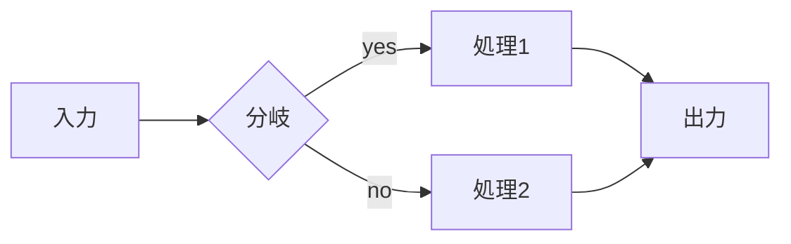
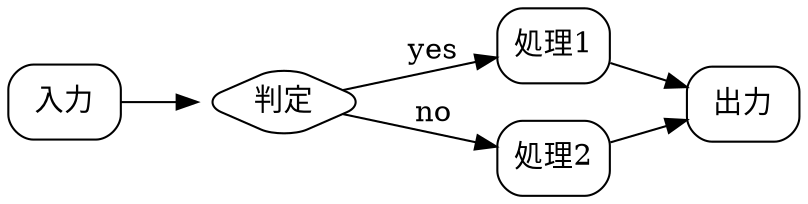

# Vivify レポート機能デモ

`,,V` で開くと、以下がすべて描画される（wavedrom / Chart.js はグルー、その他は Vivify 標準）。

---

## 1. タイミング図（WaveDrom）

```wavedrom
{ signal: [
  { name: "lk",  wave: "p......." },
  { name: "req",  wave: "0.1..0.." },
  { name: "ack",  wave: "0..1..0." },
  { name: "data", wave: "x.=.=.x.", data: ["D0", "D1"] }
],
  head: { text: "handshake" }
}
```

バス・グループ例:

```wavedrom
{ signal: [
  { name: "clk", wave: "P........" },
  {},
  { name: "bus", wave: "x.==.=x..", data: ["addr", "data", "data"] },
  { name: "weaaa",  wave: "0.1...0.." }
]}
```


---

## 2. グラフ（Chart.js）

棒グラフ:

```chart
{ type: "bar",
  data: {
    labels: ["Mon","Tue","Wed","Thu","Fri"],
    datasets: [{ label: "処理数", data: [12, 19, 7, 15, 9] }]
  },
  options: { plugins: { title: { display: true, text: "週次処理数" } } }
}
```

折れ線（複数系列）:

```chart
{ type: "line",
  data: {
    labels: ["0","1","2","3","4","5"],
    datasets: [
      { label: "A", data: [1,3,2,5,4,6], tension: 0.3 },
      { label: "B", data: [2,2,3,3,4,4], tension: 0.3 }
    ]
  }
}
```

---

## 3. フロー図（Mermaid・標準）



---

## 3b. Graphviz / dot（標準）



---

## 3c. 回路図（schemdraw / :DiagramRender）

schemdraw は Python なのでブラウザでライブ描画できない。下のフェンス内にカーソルを置いて
**`:DiagramRender`** すると、SVG 化して `` に置換される（元ソースは SVG の
`<metadata>` に同伴）。後で `![]` 行で **`:DiagramEdit`** すればソースを復元して編集→`:w` で再生成。
案A（`d` / `elm` はスコープ済）で書く:

```schemdraw
d += elm.Resistor().label('R1')
d += elm.Capacitor().label('C1').down()
d += elm.Ground()
d += elm.SourceV().up().label('V1')
```

（このフェンスは `,,V` では素のコード表示。`:DiagramRender` 実行後に画像になる。）

---

## 4. 数式（KaTeX・標準）

インライン $E = mc^2$、ブロック:

$$
\int_{0}^{\infty} e^{-x^2}\,dx = \frac{\sqrt{\pi}}{2}
$$

---

## 5. Callout / リンク（標準）

> [!NOTE]
> Vivify は callout（GitHub alerts）に対応。

> [!WARNING]
> wavedrom/chart は本文フェンスをライブ描画。編集すると追従更新する。

howm 風リンク: [[2026-07-03-1657-chiikawa]]（クリックで遷移）

---

## 6. エラー確認用（わざと壊した wavedrom）

```wavedrom
{ signal: [ { name: "x", wave: "p" }  <-- 閉じ括弧なし
```


↑ ここは "wavedrom render error: ..." と赤字で出れば正常（グルーの try/catch）。
