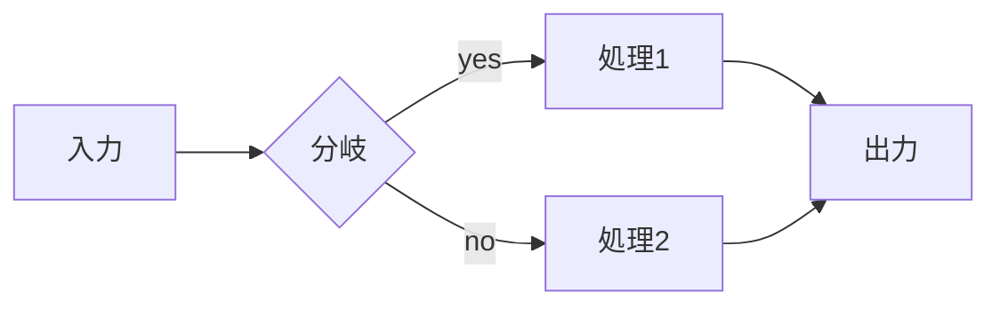
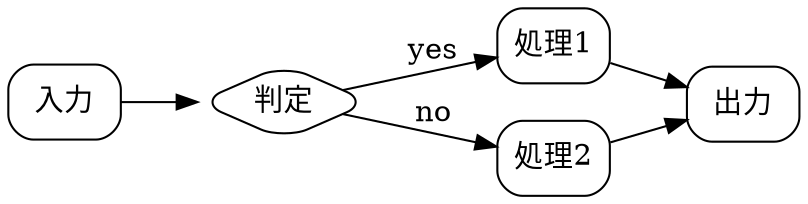

# Vivify レポート機能デモ

`,,V` で開くと、以下がすべて描画される（wavedrom / Chart.js はグルー、その他は Vivify 標準）。

---

## 1. タイミング図（WaveDrom）

```wavedrom
{ signal: [
  { name: "lk",  wave: "p......." },
  { name: "req",  wave: "0.1..0.." },
  { name: "ack",  wave: "0..1..0." },
  { name: "data", wave: "x.=.=.x.", data: ["D0", "D1"] }
],
  head: { text: "handshake" }
}
```

バス・グループ例:

```wavedrom
{ signal: [
  { name: "clk", wave: "P........" },
  {},
  { name: "bus", wave: "x.==.=x..", data: ["addr", "data", "data"] },
  { name: "weaaa",  wave: "0.1...0.." }
]}
```


---

## 2. グラフ（Chart.js）


```kvlist
DEVICE:53
;MODULE:bbbb
;MODULE_TYPE:0
;SCRIPT_TYPE:
LD MR3013
OUT MR2013
;MR3012 = 1
;MR3012 = 1
LD MR3013
AND MR3014
SET MR1000
NCJ #1000
;MR3012 = 1
LD CR2002
OUT MR3012
LABEL #1000
;
;MR3012 = 0
;MR3012 = 0
LD MR3013
ANB MR3014
SET MR1000
NCJ #1001
;MR3012 = 0
LD CR2003
OUT MR3012
LABEL #1001
;
LD MR3014
@SMOV "H:1" DM8000
END
ENDH
```

```chart
{ type: "bar",
  data: {
    labels: ["Mon","Tue","Wed","Thu","Fri"],
    datasets: [{ label: "処理数", data: [12, 19, 7, 15, 9] }]
  },
  options: { plugins: { title: { display: true, text: "週次処理数" } } }
}
```

折れ線（複数系列）:

```chart
{ type: "line",
  data: {
    labels: ["0","1","2","3","4","5"],
    datasets: [
      { label: "A", data: [1,3,2,5,4,6], tension: 0.3 },
      { label: "B", data: [2,2,3,3,4,4], tension: 0.3 }
    ]
  }
}
```

---

## 3. フロー図（Mermaid・標準）


```mermaid
graph LR
  A[入力] --> B{分岐}
  B -->|yes| C[処理1]
  B -->|no| D[処理2]
  C --> E[出力]
  D --> E
```

---

## 3b. Graphviz / dot（標準）


```dot
digraph G {
  rankdir=LR;
  node [shape=box, style=rounded];
  入力 -> 判定;
  判定 -> 処理1 [label="yes"];
  判定 -> 処理2 [label="no"];
  処理1 -> 出力;
  処理2 -> 出力;
  判定 [shape=diamond];
}
```

---

## 3c. 回路図（schemdraw）

schemdraw は Python なのでブラウザでライブ描画できない。**作ってから貼る**方式になる:

| キー | 動作 |
|---|---|
| `,,s` | Studio。**図の行ならその図**を開いて更新 / 他の行ならスクラッチ → **📋** → `,,p` |
| `,,m` | studio を立てず、テンプレから `assets/` に直接作って分割バッファで編集 |
| `,,p` | クリップボードの Python を実行して貼る（先頭に **`import figkit`** が要る） |
| `,,e` | 貼った図の上で押すと、埋込ソースを分割バッファに復元 → `:w` で再生成 |

元ソースは SVG の `<metadata>` に同伴するので、何度でも編集を再開できる。


---

## 4. 数式（KaTeX・標準）

インライン $E = mc^2$、ブロック:

$$
\int_{0}^{\infty} e^{-x^2}\,dx = \frac{\sqrt{\pi}}{2}
$$

---


## 4b. 化学式（mhchem / `\ce{}`）

添字・上付き・矢印を自分で組まなくてよい。`$...$` の中で `\ce{}` を使う。

インライン: 硫酸 $\ce{H2SO4}$、水 $\ce{H2O}$、イオン $\ce{SO4^2-}$、錯イオン $\ce{[Cu(NH3)4]^2+}$

| 書くもの | 出るもの |
|---|---|
| `$\ce{2H2 + O2 -> 2H2O}$` | $\ce{2H2 + O2 -> 2H2O}$ |
| `$\ce{N2 + 3H2 <=> 2NH3}$` | $\ce{N2 + 3H2 <=> 2NH3}$ |
| `$\ce{CaCO3 ->[\Delta] CaO + CO2 ^}$` | $\ce{CaCO3 ->[\Delta] CaO + CO2 ^}$ |
| `$\ce{AgCl v}$` | $\ce{AgCl v}$ |
| `$\ce{NaCl(aq)}$` | $\ce{NaCl(aq)}$ |

`->` が矢印、`<=>` が平衡、`^` が ↑（気体）、`v` が ↓（沈殿）、`->[...]` で矢印の上に条件。

素の数式と比べると違いが分かる: $H_2SO_4$（**斜体＝変数扱い**）と $\ce{H2SO4}$（立体＝化学式）。

構造式を**図として**描きたいときは `:Studio rdkit`（SMILES → SVG）のほう。

---

## 5. Callout / リンク（標準）

> [!NOTE]
> Vivify は callout（GitHub alerts）に対応。

> [!WARNING]
> wavedrom/chart は本文フェンスをライブ描画。編集すると追従更新する。

howm 風リンク: [[2026-07-03-1657-chiikawa]]（クリックで遷移）

---

## 6. エラー確認用（わざと壊した wavedrom）

```wavedrom
{ signal: [ { name: "x", wave: "p" }  <-- 閉じ括弧なし
```


↑ ここは "wavedrom render error: ..." と赤字で出れば正常（グルーの try/catch）。
